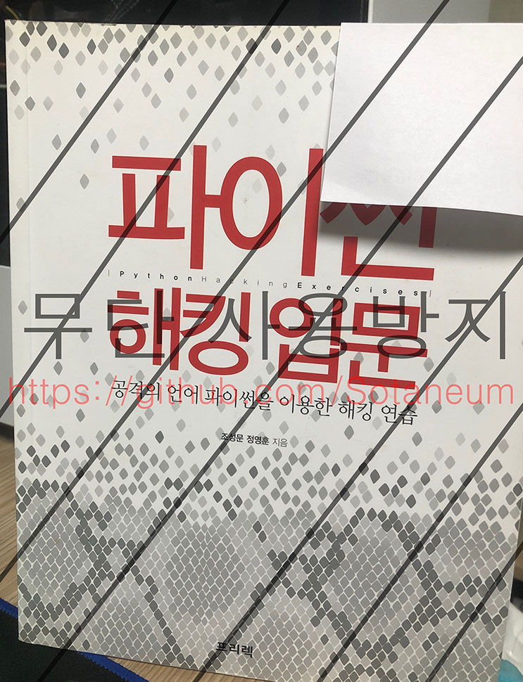

# Book:Python Hacking
《파이썬 해킹 입문》 책을 읽고 공부한 내용입니다. 

## Contents

- [3.3 `API Hooking`](./3.3&#32;API&#32;Hooking/README.md)
- [3.5 `Web Shell`](./3.5&#32;Web&#32;Shell/README.md)

## What is this book like?

- `《파이썬 해킹 입문》`은 대학교 수업에서 사용된 도서입니다. 
- Python을 처음 접하게 된 계기가 되었습니다.
- Python을 이용해서 `API 후킹`, `메시지 후킹`, `백도어`, `포트 스캐닝`을 구현하는 것을 목표로 하고 있습니다.

## What did you learn?

- Python 언어를 배울 수 있었습니다.
- `FTP` 포트 번호 및 비밀번호는 알려진 것을 사용하지 말아야 한다는 것을 배웠습니다.
- Python에서 Class 사용 방법과 함수 사용방법에 대해 배웠습니다.
- Python에서 FTP 접속 방법을 알 수 있었습니다.

## Did you do anything more in the book?

- 기존 책에서는 포트 스캐닝에서 웹 쉘 공격까지 하는 부분이 있으나 다음과 같은 방법으로 나누어 소개하고 있습니다.
  - `포트 스캐닝`
  - `FTP 비밀번호 크래킹`
  - `디렉터리 목록 조회`
  - `FTP 웹 쉘 공격`
- 각 과정은 파일 한 개에 하나의 기능으로 구성되어 있었습니다.
  - 즉, 단계별로 각각 파일을 호출해서 사용을 해야 했습니다.
- 하나의 `WebShell`이라는 클래스로 묶어 각 기능을 함수화했으며 이 과정에서 다음과 같은 것을 배울 수 있었습니다.
  - Class 만드는 법
  - Class 함수에서 self의 역할
  - 함수의 파라미터 기본값 설정 방법
  - try - except 활용법

## Finally

- Python을 처음 하시는 분이라면 [`Google-Python-Style-Guide-kor`](https://github.com/Yosseulsin-JOB/Google-Python-Style-Guide-kor)를 먼저 읽고 오시는 걸 추천해 드립니다.
- 책은 큰 글자 크기와 평균적으로 두 페이지에 1개 이상의 그림이 있습니다. 
- 책에서 소개하는 해킹 기법은 이미 막혔거나 간단한 방법으로 우회가 가능한 방법들이지만 이미 서비스하고 있는 곳으로 시도할 경우 법적 책임이 있을 수 있으므로 테스트할 때에는 테스트 환경을 구축 후 사용하세요.
- 예제 코드에서 변형된 내용만 담겨 있습니다.

## Book information

- 파이썬 해킹입문 - 공격의 언어 파이썬을 이용한 해킹 연습 ([프리렉](https://freelec.co.kr/book/해킹-기본서/))
- 도서 예제 파일 정보([링크](https://freelec.co.kr/datacenter/?board_name=DataCenter2&search_field=fn_title&search_text=%ED%8C%8C%EC%9D%B4%EC%8D%AC%20%ED%95%B4%ED%82%B9%20%EC%9E%85%EB%AC%B8&order_by=fn_pid&order_type=desc&vid=50))
- 당시 23,000원에 구매 했습니다.

## Modify Content

- 2015-06-13
  - 수업 종료 및 내용 정리

## Copyright

- 비상업적 용도로 사용 가능하며 링크를 반드시 포함해주세요.
- 문제가 되는 내용이 있다면 언제든지 [`issue`](https://github.com/Sotaneum/Python-Hacking/issues/new), [`Pull requests`](https://github.com/Sotaneum/Python-Hacking/compare) 부탁드립니다.